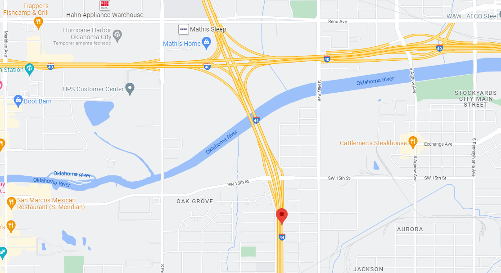
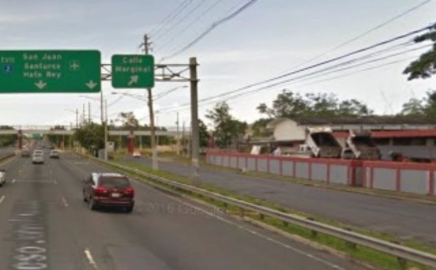

# Respostas encontradas ao desafio Capture The Flag! proposto por Menina de Cybersec em 11 de novembro de 2022

**Thayse Marques Solis**

## Web

---

### Não odeio o JavaScript!


Não foi encontrada a flag ☹️

---

### Nosferatu

A proposta trazia apenas o endereço [http://198.211.107.250:1337/](https://www.google.com/url?q=http://198.211.107.250:1337/&sa=D&source=editors&ust=1668742536514497&usg=AOvVaw1I1ooMO3E17MFfEOroMymN). Ao acessar o código fonte da página, foi possível encontrar o respectivo script dentro da tag `script`:

<script src="/static/js/index.js"></script>

Através da análise do seguinte trecho de index.js foram elencados os passos e configurações a seguir:

```js
const loadfacts = async (fact_type) => {
    await fetch('/api/getfacts', {
        method: 'POST',
        headers: {
            'Content-Type': 'application/json'
        },
        body: JSON.stringify({ 'type': fact_type })
    })
        .then((response) => response.json())
        .then((res) => {
            if (!res.hasOwnProperty('facts')){
                populate([]);
                return;
            }

            populate(res.facts);
        });
}

```

*   é feita uma chamada assíncrona à /api/getfacts 
*   usa-se o método POST
*   `Content-Type` do cabeçalho é application/json
*   dentro do corpo deve haver um JSON com `{ "type": "fact_type" }`, onde `fact_type` é um tipo passado para a função `loadfacts`.

Essa requisição foi criada usando o software Insomnia conforme exposto nas telas abaixo com os números relativos às configurações descritas a seguir.


1.  Método POST
2.  URL
3.  Configuração dos cabeçalhos
4.  Configuração do corpo em JSON

Sabe-se que no corpo da requisição é esperado um tipo `fact_type`. Uma vez que não se tem acesso ao backend, o que se pode afirmar, pela análise do código-fonte da página, é que há dois types válidos: nosferatu e secrets.

```html
<div class="btn-wrapper">
    <button id="nosferatubtn" class="btn" onclick="loadfacts('nosferatu')" >
        Nosferatu Button
    </button>

    <button id="secretsbtn" class="btn" onclick="loadfacts('secrets')">
        Secret Nosferatu
        </button>
</div>

```

Pelo Insomnia, testou-se o retorno desses tipos e os respectivos retornos são exibidos a seguir.

1.  nosferatu
```js
{
	"facts": [
		{
			"id": 1,
			"fact": "<p>Então <span class=\"highlight-number\">90%<\/span> pleno <span class=\"highlight-number letter-ss17\">95%<\/span> 2022 <span class=\":pumpkin:\">:pumpkin:<\/span>ano da copa do mundo <span class=\"highlight-word letter-ss17\"><\/span><\/p>",
			"fact_type": "nosferatu"
		},
		{
			"id": 2,
			"fact": "<p><span class=\":pumpkin:\">:pumpkin:<\/span> PLENO 2022<\/p>",
			"fact_type": "nosferatu"
		},
		{
			"id": 3,
			"fact": "<p><span class=\":pumpkin:\">:pumpkin:<\/span>ano da copa do mundo<\/p>",
			"fact_type": "nosferatu"
		},
		{
			"id": 4,
			"fact": "<p>Então <span class=\"highlight-number\">90%<\/span> pleno <span class=\"highlight-number letter-ss17\">95%<\/span> 2022 <span class=\":pumpkin:\">:pumpkin:<\/span>ano da copa do mundo <span class=\"highlight-word letter-ss17\"><\/span><\/p>",
			"fact_type": "nosferatu"
		},
		{
			"id": 5,
			"fact": "<p><span class=\":pumpkin:\">:pumpkin:<\/span> PLENO 2022<\/p>",
			"fact_type": "nosferatu"
		},
		{
			"id": 6,
			"fact": "<p><span class=\":pumpkin:\">:pumpkin:<\/span>ano da copa do mundo<\/p>",
			"fact_type": "nosferatu"
		},
		{
			"id": 7,
			"fact": "<p>Então <span class=\"highlight-number\">90%<\/span> pleno <span class=\"highlight-number letter-ss17\">95%<\/span> 2022 <span class=\":pumpkin:\">:pumpkin:<\/span>ano da copa do mundo <span class=\"highlight-word letter-ss17\"><\/span><\/p>",
			"fact_type": "nosferatu"
		},
		{
			"id": 8,
			"fact": "<p><span class=\":pumpkin:\">:pumpkin:<\/span>ano da copa do mundo<\/p>",
			"fact_type": "nosferatu"
		},
		{
			"id": 9,
			"fact": "<p><span class=\":pumpkin:\">:pumpkin:<\/span>Pleno 2022<\/p>",
			"fact_type": "nosferatu"
		},
		{
			"id": 10,
			"fact": "<p><span class=\":pumpkin:\">:pumpkin:<\/span>ano da copa do mundo<\/p>",
			"fact_type": "nosferatu"
		},
		{
			"id": 11,
			"fact": "<p><span class=\":pumpkin:\">:pumpkin:<\/span>Pleno 2022<\/p>",
			"fact_type": "nosferatu"
		},
		{
			"id": 12,
			"fact": "<p><span class=\":pumpkin:\">:pumpkin:<\/span>ano da copa do mundo<\/p>",
			"fact_type": "nosferatu"
		},
		{
			"id": 13,
			"fact": "<p><span class=\":pumpkin:\">:pumpkin:<\/span>Pleno 2022<\/p>",
			"fact_type": "nosferatu"
		},
		{
			"id": 14,
			"fact": "<p><span class=\":pumpkin:\">:pumpkin:<\/span>Pleno 2022<\/p>",
			"fact_type": "nosferatu"
		},
		{
			"id": 15,
			"fact": "<p><span class=\":pumpkin:\">:pumpkin:<\/span>Demorei a terminar<\/p>",
			"fact_type": "nosferatu"
		},
		{
			"id": 16,
			"fact": "<p><span class=\":pumpkin:\">:pumpkin:<\/span>Pleno 2022<\/p>",
			"fact_type": "nosferatu"
		},
		{
			"id": 17,
			"fact": "<p><span class=\":pumpkin:\">:pumpkin:<\/span>ano da copa do mundo<\/p>",
			"fact_type": "nosferatu"
		},
		{
			"id": 18,
			"fact": "<p><span class=\":pumpkin:\">:pumpkin:<\/span>Pleno 2022<\/p>",
			"fact_type": "nosferatu"
		}
	]
}

```

2.  secrets

```js
{
    "message": "Currently this type can be only accessed through localhost!"
}
```

Nota-se que secrets, teria que ser acessado pelo localhost, mas embora configurações tenham sido realizadas, não se descobriu uma forma de burlar tal exigência.

Posteriormente foram testadas outras requisições com type igual a "fact", "facts" e decidiu-se então, tentar um booleano ao invés de strings. Ao utilizar `{ "type": true }` no corpo da requisição, foi retornada uma flag:

```js
{
	"facts": [
		{
			"id": 19,
			"fact": "MCS{0wn3d_fl4g_f0r_typ3_Juggl1ng}",
			"fact_type": "secrets"
		}
	]
}
```

    Flag: MCS{0wn3d_fl4g_f0r_typ3_Juggl1ng}

## Análise de Artefato

---

### "Me manda no e-mail"      

Foi feito download do artefato e utilizado o seguinte comando para calcular seu hash:

    sha256sum Notificacao_-_CAIXA_ECONOMICA_FEDERAL.pdf

O retorno do comando foi:

```
6a4440a995dd031554d6f3ff71f196896287c20f5c6e664b85876b9adc6058c4
```

    Flag: MCS{6a4440a995dd031554d6f3ff71f196896287c20f5c6e664b85876b9adc6058c4}

---

### Tem técnica, mas não tem tática...                 

A técnica utilizada no artefato é a de Spearphishing Link, em que é disponibilizado um link que direciona o alvo para um website malicioso que vai solicitar informações sensíveis, como senhas, informações de cartão de crédito, conta bancária, etc. Frequentemente a técnica de Spearphishing envolve engenharia social, persuadindo o usuário a clicar ativamente ou copiar e colar um URL em um navegador. No site falso, as informações são coletadas e enviadas ao adversário.

    Flag: MCS{Spearphishing_Link}

---

### Não sei, Berg, tá estranho...

Foi realizada análise do artefato pelo serviço do Virus Total e verificou-se que o security vendor que sinalizou o artefato como malicioso foi ESET-NOD32.


    Flag: MCS{ESET_NOD32}

## Forense

---

### Phished accounts

Notou-se que no arquivo fornecido, a coluna E estava oculta e o arquivo protegido.


Então criou-se uma cópia do arquivo, salvando-o com a extensão .csv. Abrindo o novo arquivo, na coluna oculta, encontrou-se a flag:


    Flag: MCS{0wn3d_Fl4g_F0rf4n_F0r3ns3}

## OSINT-GEOINT

---

### Stalker on maps - parte 1  

Analisando o perfil de @anna_serranna, fez-se análise da foto a seguir primeiramente, por ser a mais nítida.


Seu URL foi selecionado utilizando a opção “Inspecionar elemento” do navegador. Notou-se que o endereço da imagem é:

[https://instagram.fbfh3-2.fna.fbcdn.net/v/t51.2885-15/315065342\_127753606748372\_7791914731801715766\_n.webp?stp=dst-jpg\_e35&\_nc\_ht=instagram.fbfh3-2.fna.fbcdn.net&\_nc\_cat=108&\_nc\_ohc=tDmTC0d3AXEAX-n\_HQU&edm=ALQROFkBAAAA&ccb=7-5&ig\_cache\_key=Mjk2ODgyNTc3NDIxNjkwODIyOA%3D%3D.2-ccb7-5&oh=00\_AfAPreMSzmdkMLJhYHxbRzI4ulM0B-G9sVMFWqBq1DqMoQ&oe=6379BE58&\_nc\_sid=30a2ef](https://www.google.com/url?q=https://instagram.fbfh3-2.fna.fbcdn.net/v/t51.2885-15/315065342_127753606748372_7791914731801715766_n.webp?stp%3Ddst-jpg_e35%26_nc_ht%3Dinstagram.fbfh3-2.fna.fbcdn.net%26_nc_cat%3D108%26_nc_ohc%3DtDmTC0d3AXEAX-n_HQU%26edm%3DALQROFkBAAAA%26ccb%3D7-5%26ig_cache_key%3DMjk2ODgyNTc3NDIxNjkwODIyOA%253D%253D.2-ccb7-5%26oh%3D00_AfAPreMSzmdkMLJhYHxbRzI4ulM0B-G9sVMFWqBq1DqMoQ%26oe%3D6379BE58%26_nc_sid%3D30a2ef&sa=D&source=editors&ust=1668742536554804&usg=AOvVaw2hJ5ndcTziZNSwG8vRwZ3R)

Ela foi utilizada para fazer uma busca reversa no Google, utilizando a opção de link da imagem.


Foi selecionada a busca por texto, que permitiu o acesso à seguinte imagem relacionada ([http://www.okroads.com/062303/i44okexit119.JPG](https://www.google.com/url?q=http://www.okroads.com/062303/i44okexit119.JPG&sa=D&source=editors&ust=1668742536555654&usg=AOvVaw3vKxWViJntFq1_2n7D6Mxy))


Nota-se que é exatamente o mesmo local onde a foto de @anna_serranna foi tirada. Ao analisar a página que contém a foto, informação mais precisa do local é obtida:


Segundo tal página, a foto foi tirada na Interestadual 44 e a Interestadual 40 é uma milha a frente. A placa indica ¾ de milha, mas o que merece investigação é se há uma I-44 que leva à I-40.

Buscando-se no Google Maps vê-se que há uma I-44 que de fato leva à I-40.


Há ¾ de milha da I-40, devemos encontrar a placa da foto. Na localização abaixo, um pouco antes do cruzamento da I-40 com a I-44, foi selecionada a vista da rua.



Este é exatamente o ponto em que a foto de @anna_serranna foi tirada. Segundo o Google Maps, tal local fica em Oklahoma City em Oklahoma.


Foi possível descobrir apenas que ela passou por Oklahoma City em Oklahoma, mas não foi encontrada a flag ☹️.

---

### Stalker on maps - parte 2

Analisando-se a imagem a seguir, disponível no perfil de @anna_serranna, vê-se que a primeira placa verde parece indicar San Juan, que fica em Porto Rico.



A imagem não está nítida, mas com o apoio de um mapa de Porto Rico, podemos inferir que os demais textos nas placas são: Santurce, Hato Rey e Calle (rua, em espanhol) Marginal. Além disso, é possível ler ESTE na primeira placa e o que parece ser o número 2 dentro do símbolo com fundo azul, além do símbolo de aeroporto (à direita na primeira placa).


Sendo assim, escolheu-se começar a análise pela via expressa de número 2. Ao escolher a vista da rua, foi encontrada uma placa fazendo referência ao que se inferiu:


Além disso, havia uma foto com um caminhão da Maersk que é um conglomerado que trabalha com transporte de contêineres, encaminhamento logístico e frete, balsa e transporte de petroleiro, estaleiros, etc (fonte: [https://pt.wikipedia.org/wiki/Maersk](https://www.google.com/url?q=https://pt.wikipedia.org/wiki/Maersk&sa=D&source=editors&ust=1668742536558696&usg=AOvVaw1DeBmMn2qmA8Ji47JTCbPC)). Além disso @annaserranna postou a foto de uma placa em que se diz "Precaucion. Salida de camiones". Logo, pode-se imaginar que tal local pudesse estar próximo à alguma zona portuária.

Ao seguir pouco à frente pela via 2 no Google Maps, encontra-se a seguinte placa, que indica Zona Portuária, confirmando a hipótese levantada.


Pouco mais adiante, encontrou-se exatamente o local onde a foto de @annaserranna foi tirada. Temos o caminhão da Maersk, que aparece no Google Maps:


A placa de saída de caminhões:


E a placa da via, indicando o local


No momento da foto, ela estava na via 2, de nome Expreso John F. Kennedy em San Juan, Porto Rico  mas não foi encontrada a flag ☹️


([https://www.google.com/maps/@18.4355777,-66.0858593,3a,75y,47.53h,74.5t/data=!3m6!1e1!3m4!1sgMsFGiHWSLGxNFY44-jsug!2e0!7i13312!8i6656](https://www.google.com/url?q=https://www.google.com/maps/@18.4355777,-66.0858593,3a,75y,47.53h,74.5t/data%3D!3m6!1e1!3m4!1sgMsFGiHWSLGxNFY44-jsug!2e0!7i13312!8i6656&sa=D&source=editors&ust=1668742536560634&usg=AOvVaw3NoyljcT-xV2fZu5gn5VQd))

---

### Onde está o Olly? Não!

Usando a mesma técnica descrita na etapa anterior, obteve-se o link da imagem do aeroporto postada por @anna-serranna:

[https://instagram.fbfh3-3.fna.fbcdn.net/v/t51.2885-15/315073544\_8232066596863513\_4097770872029032381\_n.webp?stp=dst-jpg\_e35&\_nc\_ht=instagram.fbfh3-3.fna.fbcdn.net&\_nc\_cat=101&\_nc\_ohc=Pd-D9Lqa5MYAX8AiITh&edm=ALQROFkBAAAA&ccb=7-5&ig\_cache\_key=Mjk2ODgyNTU4MjYwNDMwNzA4MQ%3D%3D.2-ccb7-5&oh=00\_AfDZiYbaMg2Nz-S0Ozf3Jfs0xztE5dBrzuKL9EG3k3yZhg&oe=63794B73&\_nc\_sid=30a2ef](https://www.google.com/url?q=https://instagram.fbfh3-3.fna.fbcdn.net/v/t51.2885-15/315073544_8232066596863513_4097770872029032381_n.webp?stp%3Ddst-jpg_e35%26_nc_ht%3Dinstagram.fbfh3-3.fna.fbcdn.net%26_nc_cat%3D101%26_nc_ohc%3DPd-D9Lqa5MYAX8AiITh%26edm%3DALQROFkBAAAA%26ccb%3D7-5%26ig_cache_key%3DMjk2ODgyNTU4MjYwNDMwNzA4MQ%253D%253D.2-ccb7-5%26oh%3D00_AfDZiYbaMg2Nz-S0Ozf3Jfs0xztE5dBrzuKL9EG3k3yZhg%26oe%3D63794B73%26_nc_sid%3D30a2ef&sa=D&source=editors&ust=1668742536561640&usg=AOvVaw2fq_To398NnaYmNZmMr6bz)

e fez-se uma busca a partir da imagem usando o Google Lens.

 

Foi possível identificar que tal aeroporto era o aeroporto de Istanbul. Sua sigla foi obtida pela Wikipedia, podendo ser em dois formatos.


A flag deve ser formada juntando a sigla do aeroporto e o país, logo só havia duas alternativas `MCS{IST_Turquia}` ou `MCS{LTFM_Turquia}`. A flag válida é:

    Flag: MCS{IST_Turquia}

## Programming

---

### Fibowhat

Ao analisar o código, a primeira falha notada é que não há uma função `main` declarada; o que é obrigatório em um código C. Tal falha corresponde à flag.

    Flag: MCS{main}

---

### Network

Algumas das falhas observadas no código foram:

*   O tipo `int` normalmente tem 4 bytes em C, mas isto não é uma regra universal: dependendo da plataforma, o `int` pode ter menos ou mais bytes. A variável numero deveria ser do tipo `int32` (ou `uint32`), garantindo assim que a variável tenha 4 bytes.

*   Antes de transferir um inteiro de 32 bits pela rede, é preciso garantir que a ordem dos bytes esteja dentro de um padrão (endianess): convencionalmente, big endian. Ao enviar, é preciso usar a função `htonl` (here to network - long int), que converte os bytes do inteiro para network byte order (big endian, ou seja, começando pelo MSB). Já no recebimento, os bytes do inteiro devem ser convertidos para a ordem usada na máquina atual, o que é feito através da função `ntohl` (network to here - long int).
*   A função `send` pode falhar, o que é indicado pelo seu valor de retorno. Entretanto, isso não está sendo verificado no código: se a função falhar, o retorno será -1, e deveria haver algum tratamento para este caso.

*   A função `recv` também pode falhar, o que é indicado pelo seu valor de retorno. Isso também não está sendo verificado no código e deveria haver algum tratamento para este caso.

*   Se a função `recv` falhar, o valor da variável `numero` será mantido inalterado, e seu valor será impresso em console antes mesmo de ser inicializado, o que poderia ser usado, se fosse parte de um programa maior, para expor algum dado da pilha para um atacante.

Ao final, não foi encontrado o nome exato do erro que conferisse com uma flag. ☹️

---

### Keep calm, don't panic!

O arquivo contém um código em Brainfuck. Utilizando um interpretador Brainfuck, como o disponível em [https://www.dcode.fr/brainfuck-language](https://www.google.com/url?q=https://www.dcode.fr/brainfuck-language&sa=D&source=editors&ust=1668742536568130&usg=AOvVaw0-RqMzK1h3l8uqgFv10VFD), tem-se a seguinte saída: Hello world!

    Flag: MCS{Hello_world!}

## Easy

---

### Nomeie essa tool

A imagem corresponde ao logo da Burp Suite.


Fonte: [https://portswigger.net/cms/images/53/f4/9165634fec8f-article-enterprise\_logo\_-\_article.png](https://www.google.com/url?q=https://portswigger.net/cms/images/53/f4/9165634fec8f-article-enterprise_logo_-_article.png&sa=D&source=editors&ust=1668742536570220&usg=AOvVaw1btR1hAe4tOlN3V5aVw4Jz)

    Flag: MCS{burp_suite}

---

### Nomeie essa tool (2)

A imagem  corresponde ao logo do NMAP.


Fonte: [https://nmap.org/images/nmap-logo-256x256.png](https://www.google.com/url?q=https://nmap.org/images/nmap-logo-256x256.png&sa=D&source=editors&ust=1668742536571867&usg=AOvVaw1zYTFtBQawza4hR5WF5biT)

    Flag: MCS{nmap}

---

### Nomeie essa tool (3)

Foi dada a seguinte figura:


A imagem corresponde à representação em big endian, em que o byte mais significativo (MSB) é o primeiro byte (com menor endereço em memória), e o menos significativo (LSB) é o último (com maior endereço em memória).

    Flag: MCS{big_endian}

---

### Hackerman

A imagem tem relação com a série Mr. Robot. Nela, entre outras coisas, é exibido o nome da fsociety, que é um grupo hacker que aparece na série.

Flag: MCS{mr_robot}

---

### Fã número 1 da menina de CyberSec

A proposta continha o seguinte conteúdo:

> A @anna_serranna acha que é a fâ número 1, mas sabemos que é você <3
>
> Qual a primeira live da menina de cybersec?
>
> Será que você consegue fazer um decode Base64?

Foram analisados o perfil de @anna_serrana, o poster no Instagram com a chamada da primeira Live da Menina de Cybersec a seguir, assim, como a mensagem com a divulgação do evento no Discord, e a postagem que menciona a live e Nathália Soares no LinkedIn, mas não foi encontrado nada em Base64 ☹️.


Poster de divulgação postado no link:

[https://www.instagram.com/p/CfJ77IqO3Of/](https://www.google.com/url?q=https://www.instagram.com/p/CfJ77IqO3Of/&sa=D&source=editors&ust=1668742536577211&usg=AOvVaw3kMDx83UMwj9ba0IUegF0s)


Divulgação da primeira live da Menina de Cybersec no Discord

## Phishing Analysis

---

### O SOC sofre... (1)

O endereço de IP que enviou o e-mail é:


    Flag: MCS{209.85.222.173}

---

### O SOC sofre... (2)

O e-mail que preenche o campo `From:`:


    Flag: MCS{santormcconnellw9660@gmail.com}

---

### O SOC sofre... (3)

A vítima desse e-mail foi:


    Flag: MCS{rosinha@hotmail.com}